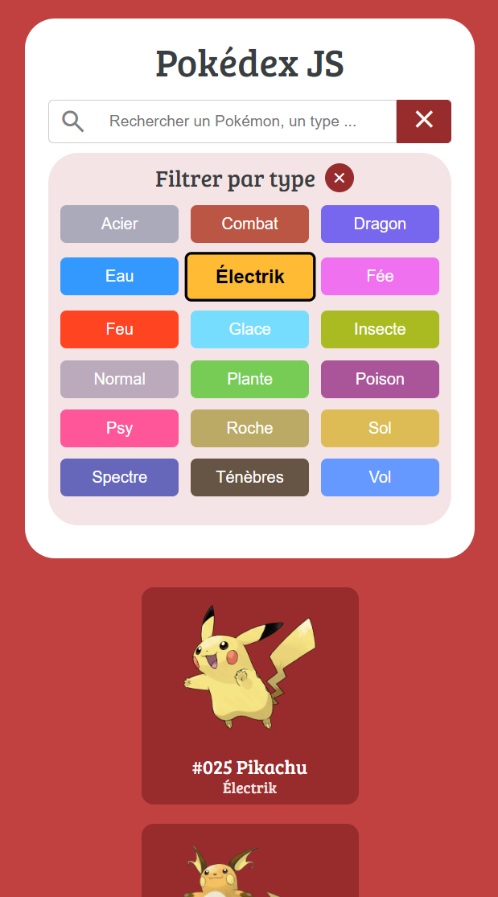
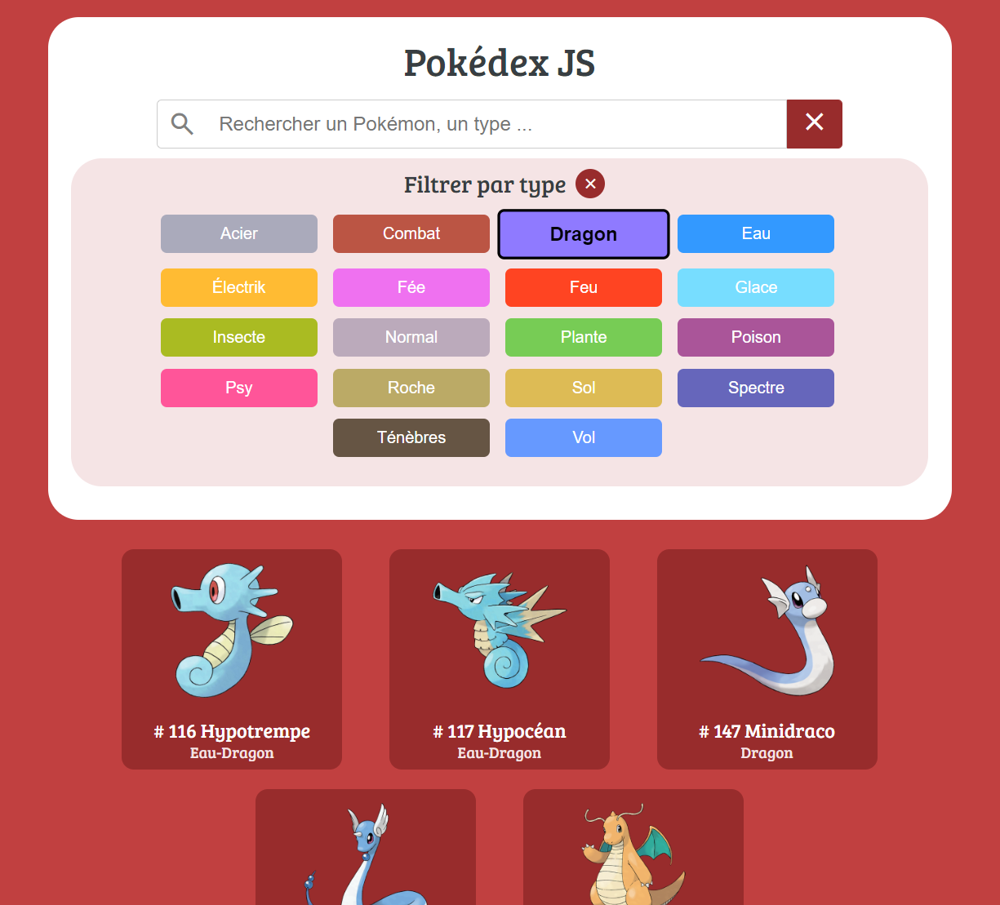
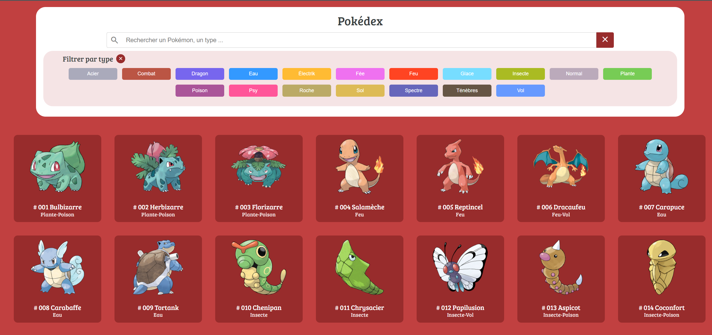
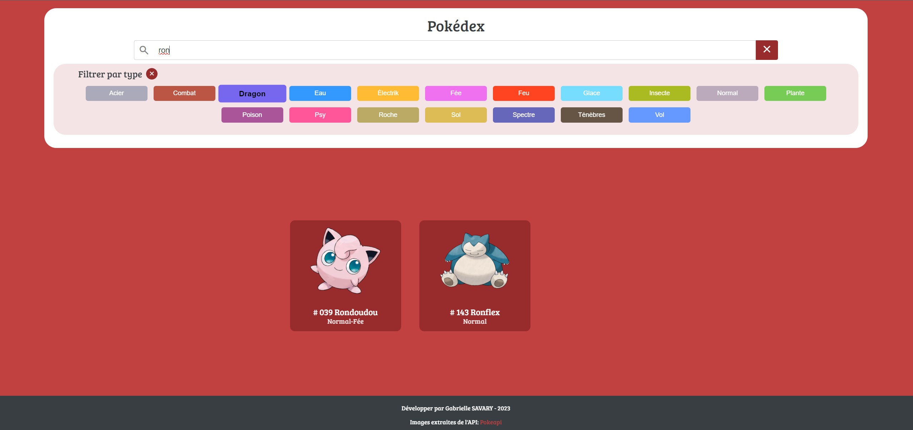

# Pokedex-JS 

## Description
Ce projet est un exercice d'entraînement à la manipulation du DOM en utilisant HTML, CSS et JavaScript pour créer une page web dynamique et responsive représentant un Pokédex de 151 Pokemons.
Un Pokédex est un dispositif électronique fictif qui répertorie et stocke des informations sur les Pokémons. Chaque Pokémon a ses propres caractéristiques et types, ce qui les rend uniques et intéressants.

## Objectif
La page d'accueil du Pokédex devrait accomplir les tâches suivantes :

1. **Barre de Recherche :** Une barre de recherche est mise en place pour permettre aux utilisateurs de rechercher des Pokémon spécifiques par leur nom, leur numéro ou leur type.

2. **Filtrage par Type :** Des boutons de filtrage sont inclus pour permettre aux utilisateurs de filtrer les Pokémon en fonction de leurs types (par exemple, Plante, Feu, Eau, etc.).
   
3. **Suppression du filtrage par Type et de la recherche:** Des boutons de suppression du filtrage et du texte de rechecher sont inclus pour permettre aux utilisateurs de retrouver le pokedex complet.

## **Comment Utiliser le Pokédex**
1. Clonez ce référentiel (repository) sur votre ordinateur.
2. Ouvrez le fichier `index.html` dans votre navigateur web pour accéder au Pokédex.

## **Technologies Utilisées**
- HTML 🖥️
- CSS 🎨
- JavaScript (Vanilla) 🧪

## **Auteur**
[Gabrielle SAVARY]

## **Remarques**
Ce projet a été créé dans le cadre d'un exercice d'entraînement à la manipulation du DOM avec JavaScript et répondre à la compétence A1 CP3 du titre professionnel Developpeur Web et Web Mobile. 
Il est destiné à aider les développeurs à renforcer leurs compétences en HTML, CSS et JavaScript, ainsi qu'à les familiariser avec la création de pages web dynamiques.
Il s'inspire d'un exercice bonus conçu par l'organisme de formation O'clock de la création d'un pokedex avec un serveur express.

## **Aperçu du Projet**
### Mobile

### Tablette

### Desktop

