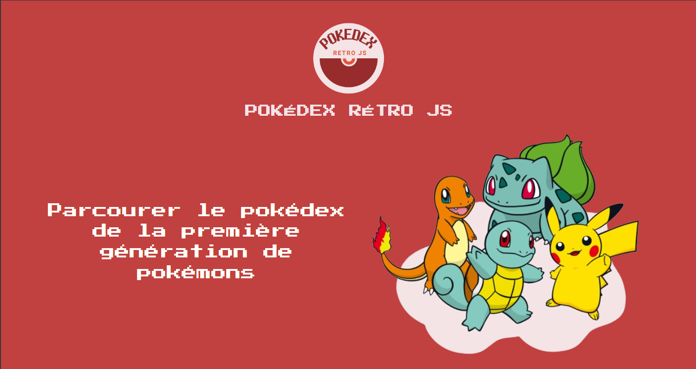
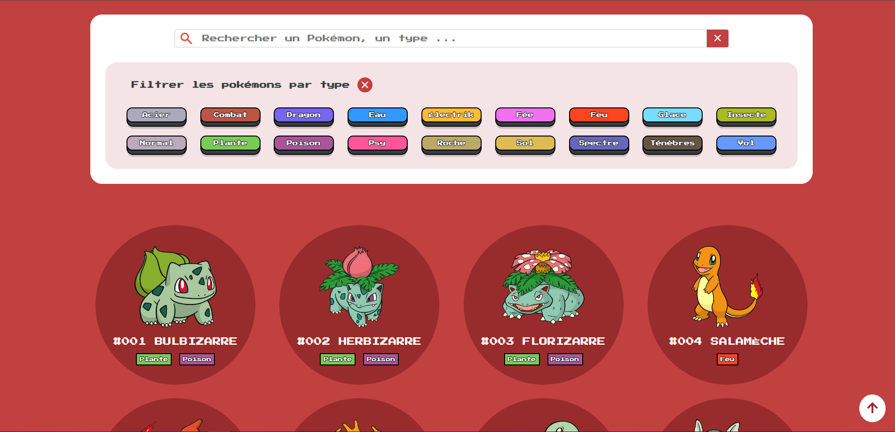
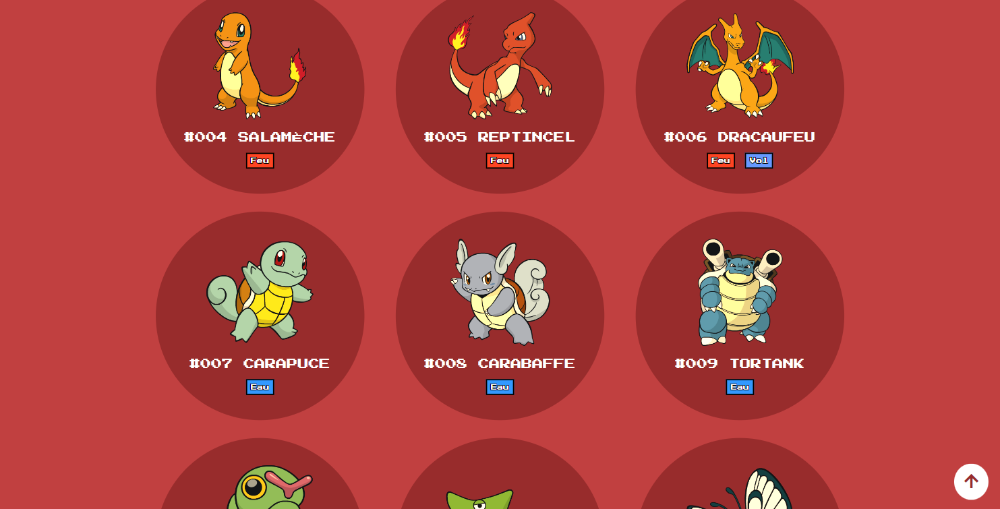
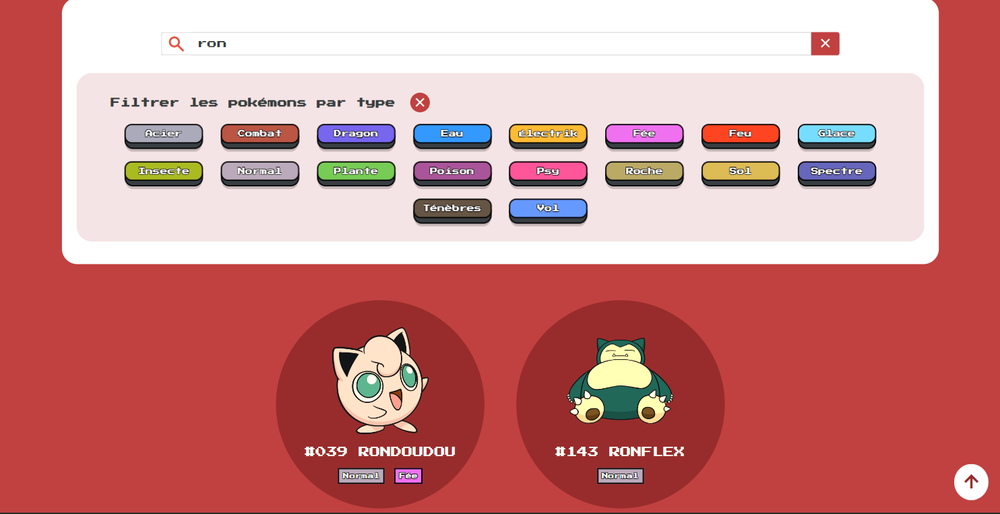
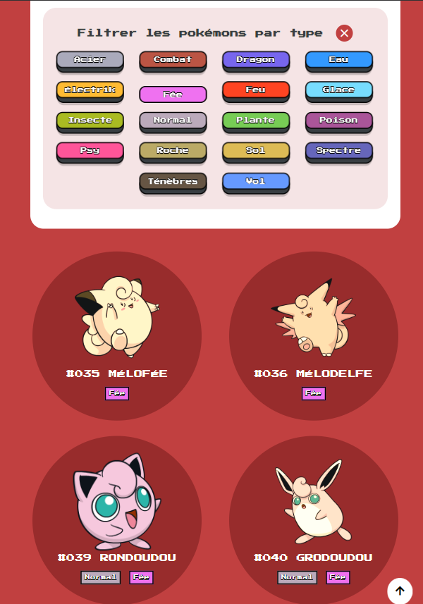
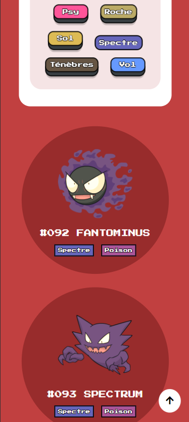

# Pokédex-rétro JS  

## Description
Ce mini-projet est une single page qui permet de parcourir avec nostalgie un Pokédex la première génération de pokemons (soit une liste de 151 pokemons 🦄).  
Il est possible de filtrer les pokémons (recherche libre avec une barre de recherche ou par type de pokemon avec des boutons).  
Ce projet est un exercice d'entraînement à la manipulation du DOM en utilisant HTML, CSS et JavaScript (vanilla) pour créer une page web dynamique et responsive.

### Le  côté rétro est apporté par:
- le choix de la police.
- les images des pokémons qui sont fidèles aux désigns lors de la diffusion TV dans les années 90.
- les boutons de filtres des  types de pokemons qui immitent les touches d'un clavier mécanique.
- un filtre sépia appliqués aux pokemons qui disparait lors du survol du pokemon.
 
 

## Fonctionnalités
La page d'accueil du Pokédex devrait accomplir les tâches suivantes :

1. &#x1F50D;**Barre de Recherche :** Elle permet aux utilisateurs de rechercher des Pokémons spécifiques par leur nom, leur numéro ou leur type.

2. &#x2328;**Filtrage par Type de pokemon :** Des boutons de filtrage sont inclus pour permettre aux utilisateurs de filtrer les Pokémons en fonction de leurs types (par exemple, Plante, Feu, Eau, etc.).
   
3. &#x274C;**Suppression du filtrage par Type et de la recherche :** Des boutons de suppression des filtres (icones avec le symbole de croix) et de la recherche permettent aux utilisateurs de retrouver le pokedex complet.
   
4. &#x1F51D;**Bouton scroll to top :** Dès que le scroll est activé sur la page le bouton apparait. Il permet de revenir en haut de la page du pokedex.
 
 

## **Technologies Utilisées**
- HTML 🖥️
- CSS 🎨
- JavaScript (Vanilla) 🧪
 
 

## **Comment Utiliser le Pokédex**
1. Clonez ce référentiel (repository) sur votre ordinateur.
2. Ouvrez le fichier `index.html` dans votre navigateur web pour accéder au Pokédex. 
 
 

## **Remarques**: 
Ce projet a été créé pour répondre à la compétence A1 CP3 du titre professionnel Developpeur Web et Web Mobile. 
Son design a été retravaillé en 2024 pour donner l'aspect rétro.
 
 

## **Auteur**: Gabrielle SAVARY  
 
 
  

## **Aperçu du Projet**
### Desktop

#### Desktop - barre de recherche: "ron"

### Tablette - filtre type fée (survol pokemon rondoudou)

### Mobile - filtre type spectre

