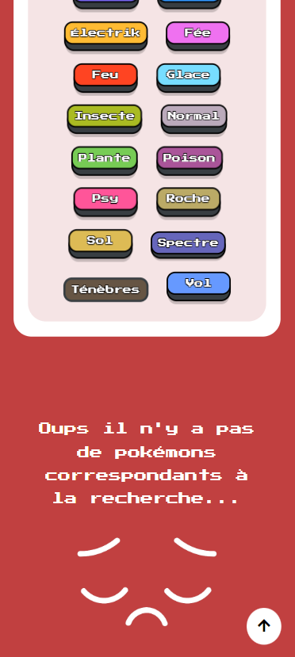

# Pokédex-rétro JS  

## <u>DESCRIPTION</u>
Cette single page vous invite à explorer avec nostalgie le Pokédex de la première génération en affichant la liste des 151 Pokémons emblématiques.  
L'utilisateur peut parcourir le Pokédex ou filtrer les Pokémons (recherche libre avec une barre de recherche ou par type de pokemon avec des boutons).  
 
Ce mini-projet est un exercice d'entraînement à la manipulation du DOM en utilisant HTML, CSS et JavaScript (vanilla) pour créer une page web dynamique et responsive.
Il a été créé pour répondre à la compétence A1 CP3 du titre professionnel Developpeur Web et Web Mobile. 
Son design a été retravaillé en 2024 pour donner l'aspect rétro.

#### L'aspect rétro est apporté par:
- Le choix d'une police pixélisée.
- Les images des pokémons qui sont fidèles aux désigns des années 90.
- Les boutons de filtres des types de pokemons qui immitent les touches d'un clavier mécanique.
- L'application d'un filtre sépia qui est appliqués aux pokemons (il disparait lors du survol du pokemon).
 
 

## <u>FONCTIONNALITÉS</u>

### &#x1F440; Afficher le pokédex complet de la 1ère génération de Pokémons

### 🦄 Filtrer les Pokémons: 
1. &#x1F50D;**Barre de Recherche :** Elle permet aux utilisateurs de rechercher des pokémons spécifiques par leur numéro, nom ou type(s).  
   recherche: "001 eau" --> est égale à rechercher "001" **OU** "eau" --> le Pokémon identifié au numéro 1 s'affiche, ainsi que tous les Pokemons de type eau, ainsi que les Pokémons dont le nom contient les lettres "eau".

2. &#x2328; **Boutons par Type de pokemon :** Ces boutons permettent de filtrer les pokémons par leurs types. 
    filtre actif Plante --> tous les pokémons de type "Plante" s'affichent  
    filtres actifs: "Plante" et "Poison" --> tous les Pokémons de type "Plante" **ET** "Poison" cumulés s'affichent. Un Pokémon a au maximum 2 types.
   
3. &#x274C;**Supprimer les filtres appliqués aux pokémons :** Deux boutons (icones avec le symbole de croix) permettent de supprimer les filtres appliqués  afin de retrouver le pokedex complet.

### &#x1F51D;**Bouton scroll to top ** 
Visible lors du défilement du pokedex, ce bouton permet de revenir en haut de la page du pokedex.
 
 

## **<u>TECHNOLOGIES UTILISÉES</u>**
- HTML 🖥️
- CSS 🎨
- JavaScript (Vanilla) 🧪
 
 

## **<u>LAANCEZ LE POKÉDEX</u>**
Le site est en ligne, vous pouvez explorer le Pokédex:  [EN CLIQUANT ICI](https://gabrielle-savary.github.io/Pokedex-retro-js/) 
 
<u>**Version Dev**</u>
- Clonez ce repository sur votre ordinateur.
- Ouvrez le fichier `index.html` dans votre navigateur web pour accéder au Pokédex. Ou lancer un "go live" à partir de VScode.
 
 

## **<u>AUTEUR</u>**: Gabrielle SAVARY  
 
 
  

## **<u>APERÇU DU PROJET</u>**

### Desktop - Page d'accueil

### Desktop - barre de recherche: "ron"

### Tablette - filtre type fée (survol pokemon rondoudou)

### Mobile - filtre type spectre (aucun pokémon, c'est un piège !)

## **<u>MENTIONS</u>**
Les images proveniennent du site [Pokekalos](https://www.pokekalos.fr/jeux/tools/download.html) 